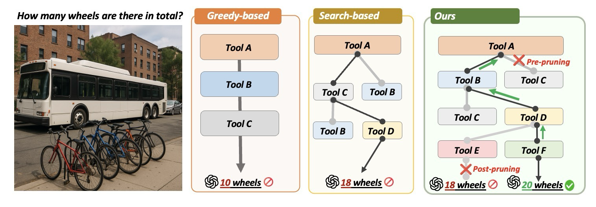
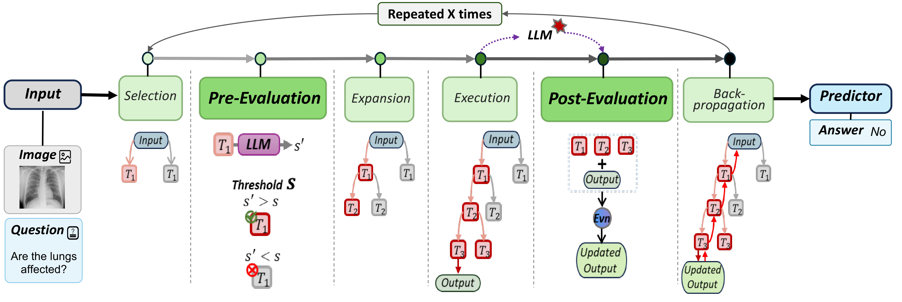
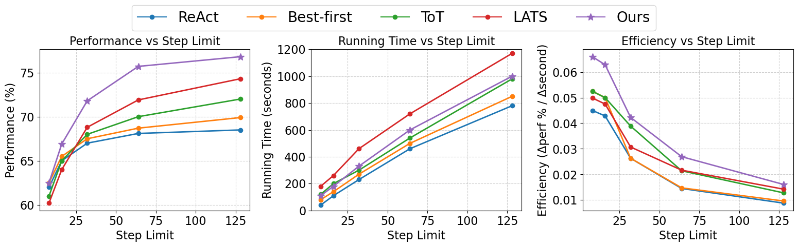
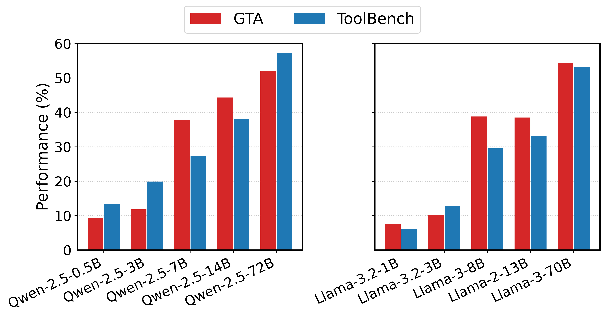
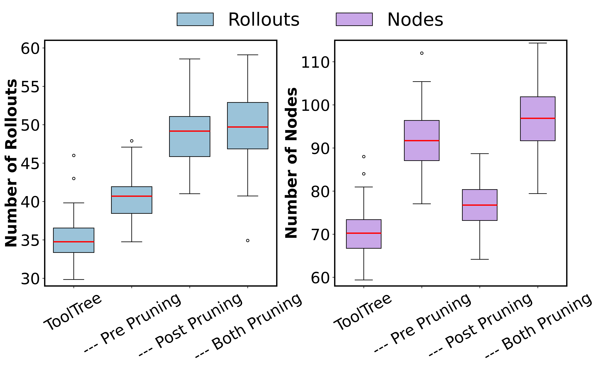
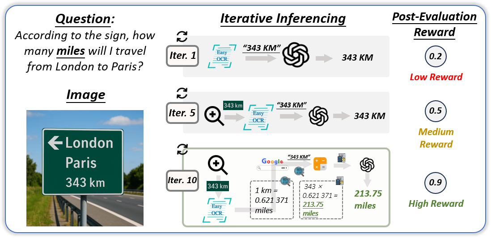
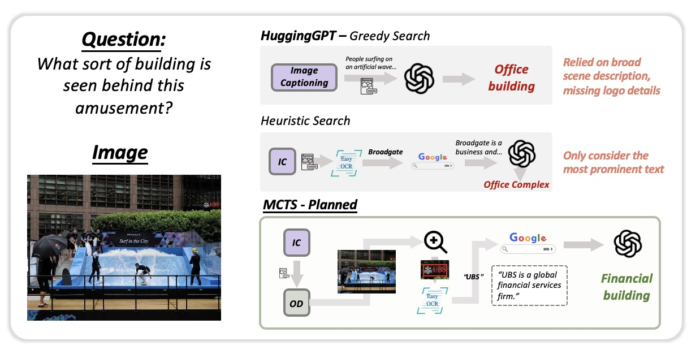

<h1 align="center">ToolTree: Efficient LLM Agent Tool Planning via<br>Dual-Feedback Monte Carlo Tree Search and Bidirectional Pruning</h1>

<p align="center">
  <b>Accepted at the The Fourteenth International Conference on Learning Representations (ICLR 2026)</b>
</p>

<p align="center">
  Shuo Yang<sup>1</sup> &nbsp;&nbsp; Caren Han<sup>1</sup> &nbsp;&nbsp; Yihao Ding<sup>2</sup> &nbsp;&nbsp; Shuhe Wang<sup>1</sup> &nbsp;&nbsp; Eduard Hovy<sup>1</sup>
</p>
<p align="center">
  <sup>1</sup>The University of Melbourne &nbsp;&nbsp; <sup>2</sup>The University of Western Australia
</p>

<p align="center">
  <a href="https://openreview.net/forum?id=Ef5O9gNNLE"></a>
  <a href="https://openreview.net/pdf?id=Ef5O9gNNLE"></a>
  <a href="https://github.com/SYang2000/ICLR_2026_ToolTree"></a>
  <a href="LICENSE"></a>
</p>

---

## Overview

**ToolTree** is a novel Monte Carlo tree search-inspired planning paradigm for LLM agent tool planning. It explores possible tool usage trajectories using a **dual-stage LLM evaluation** and **bidirectional pruning** mechanism that enables the agent to make informed, adaptive decisions over extended tool-use sequences while pruning less promising branches before and after the tool execution.


<p align="center">
  
  <br>
  <em>Figure 1: Comparison of ToolTree with greedy search and search-based tool planning. ToolTree chooses the optimal tool trajectory and answers correctly with bidirectional pruning.</em>
</p>

## Architecture

<p align="center">
  
  <br>
  <em>Figure 2: Architecture overview of ToolTree. An input query is processed sequentially via iterative dual evaluation-guided Monte Carlo Tree Search, including selection, pre-evaluation, expansion, execution, post-evaluation and backward-propagation.</em>
</p>

### Key Components

- **Pre-Evaluation**: A fast predictive signal that estimates the utility of a tool *before* execution, filtering schema- or slot-incompatible calls before expansion.
- **Post-Evaluation**: Assesses the actual contribution of a tool *after* execution based on observed outcomes, pruning unproductive branches using real feedback.
- **Bidirectional Pruning**: Combines pre- and post-evaluation to eliminate unpromising branches, concentrating computational budget on promising tool chains.
- **Answer Predictor**: Incorporates the tool trajectories with the highest reward found by the MCTS to produce the final prediction.

## Results

ToolTree achieves state-of-the-art performance across 4 benchmarks spanning both closed-set and open-set tool planning scenarios, with an average gain of ~10% over existing methods.

### Closed-Set Tool Planning (GTA & m&m)

**Table 1:** Comparison on GTA and m&m under GPT-4o (step-by-step and end-to-end modes).

| Method | GTA (GPT-4o) | | | | AVG | m&m (GPT-4o) | | | | AVG |
|:---|:---:|:---:|:---:|:---:|:---:|:---:|:---:|:---:|:---:|:---:|
| | Tool | Arg | Plan | Exec | | Tool | Arg | Plan | Exec | |
| Zero-shot | 70.16 | 38.52 | 77.14 | 45.28 | 57.78 | 78.52 | 80.17 | 85.17 | 78.47 | 80.58 |
| ReAct | 71.42 | 40.58 | 75.52 | 46.33 | 58.46 | 83.58 | 81.24 | 84.42 | 76.58 | 81.46 |
| CoT | 66.52 | 42.17 | 73.22 | 42.86 | 56.69 | 85.58 | 77.84 | 78.16 | 71.43 | 78.75 |
| Best-First | 72.13 | 44.26 | 77.64 | 47.83 | 60.46 | 84.47 | 82.17 | 85.84 | 78.11 | 82.65 |
| ToT | 72.53 | 43.68 | 78.84 | 46.53 | 60.40 | 86.28 | 83.74 | 85.26 | 80.35 | 83.91 |
| A* | 74.29 | 47.58 | 79.96 | 46.26 | 62.52 | 87.17 | 83.44 | 86.87 | 81.49 | 84.74 |
| LATS | 77.84 | 49.90 | 82.57 | 48.80 | 64.78 | 88.89 | 84.77 | 88.38 | 83.77 | 86.45 |
| **ToolTree (Ours)** | **79.26** | **50.84** | **85.53** | **52.17** | **66.95** | **91.92** | **86.16** | **90.47** | **85.88** | **88.61** |

### Open-Set Tool Planning (ToolBench & RestBench)

**Table 2:** Open-set results on RestBench and ToolBench using GPT-4o.

| Method | RestBench-TMDB | | AVG | RestBench-Spotify | | AVG | ToolBench | | AVG |
|:---|:---:|:---:|:---:|:---:|:---:|:---:|:---:|:---:|:---:|
| | Pass | Win | | Pass | Win | | Pass | Win | |
| Zero-shot | 56.28 | 50.00 | 53.14 | 49.54 | 50.00 | 49.77 | 47.58 | 50.00 | 48.79 |
| CoT | 58.52 | 52.32 | 55.42 | 47.92 | 44.55 | 46.23 | 46.88 | 47.57 | 47.23 |
| ReAct | 62.42 | 66.17 | 64.30 | 53.27 | 60.72 | 57.00 | 52.38 | 63.39 | 57.89 |
| DFSDT | 66.57 | 69.08 | 67.82 | 55.48 | 71.63 | 63.55 | 54.86 | 68.59 | 61.73 |
| LATS | 68.26 | 74.44 | 71.35 | 61.25 | 75.80 | 68.53 | 59.25 | 73.85 | 66.55 |
| **ToolTree (Ours)** | **72.40** | **75.59** | **74.50** | **60.87** | **78.84** | **71.36** | **61.27** | **76.81** | **69.04** |

### Efficiency Analysis

<p align="center">
  
  <br>
  <em>Figure 3: Progressive efficiency analysis across step limits. ToolTree achieves the highest efficiency (performance gain per second) compared with all baselines.</em>
</p>

### Model Scaling Analysis

<p align="center">
  
  <br>
  <em>Figure 4: Performance with respect to backbone model scale on GTA and ToolBench.</em>
</p>

### Ablation: Effect of Bidirectional Pruning

<p align="center">
  
  <br>
  <em>Figure 5: Ablation study on pruning strategies. Bidirectional pruning (both pre- and post-pruning) achieves the fewest rollouts and nodes, demonstrating the highest efficiency.</em>
</p>

### Case Study

<p align="center">
  
  <br>
  <em>Figure 6: A sample case of ToolTree on GTA. ToolTree progressively finds better tool trajectories guided by both pre-evaluation and post-evaluation rewards.</em>
</p>

### More Case Studies (Appendix)

<p align="center">
  
  <br>
  <em>Figure 10(a): A qualitative case study showcasing ToolTree's iterative tool orchestration on a radiology image question (medical VQA).</em>
</p>

<p align="center">
  
  <br>
  <em>Figure 10(b): A qualitative case study showcasing ToolTree's iterative tool orchestration on a multi-hop knowledge reasoning task.</em>
</p>

## Installation

```bash
git clone https://github.com/SYang2000/ICLR_2026_ToolTree.git
cd ICLR_2026_ToolTree
pip install -r requirements.txt
```

## Quick Start

```bash
# Run on GTA benchmark
bash scripts/run_gta.sh

# Run on ToolBench benchmark
bash scripts/run_toolbench.sh

# Run on RestBench benchmark
bash scripts/run_restbench.sh

# Run on m&m benchmark
bash scripts/run_mm.sh
```

## Project Structure

```
ICLR_2026_ToolTree/
├── assets/                  # Figures and images
├── configs/                 # Configuration files
│   ├── default.yaml
│   ├── gta.yaml
│   └── toolbench.yaml
├── data/                    # Datasets (download separately)
├── scripts/                 # Experiment launch scripts
│   ├── run_gta.sh
│   ├── run_toolbench.sh
│   ├── run_restbench.sh
│   └── run_mm.sh
├── src/
│   ├── mcts/                # Monte Carlo Tree Search core
│   │   ├── tree_search.py   # Main MCTS algorithm
│   │   ├── node.py          # Tree node definition
│   │   └── pruning.py       # Bidirectional pruning
│   ├── agents/              # LLM agent implementations
│   │   ├── tooltree_agent.py
│   │   └── base_agent.py
│   ├── tools/               # Tool management
│   │   ├── tool_manager.py
│   │   └── tool_registry.py
│   └── evaluation/          # Evaluation metrics
│       ├── metrics.py
│       └── benchmarks.py
├── requirements.txt
├── LICENSE
└── README.md
```

## Citation

If you find this work useful, please cite our paper:

```bibtex
@inproceedings{yang2026tooltree,
  title={ToolTree: Efficient LLM Tool Planning via Dual-Feedback Monte Carlo Tree Search and Bidirectional Pruning},
  author={Yang, Shuo and Han, Caren and Ding, Yihao and Wang, Shuhe and Hovy, Eduard},
  booktitle={International Conference on Learning Representations (ICLR)},
  year={2026},
  url={https://openreview.net/forum?id=Ef5O9gNNLE}
}
```

## License

This project is licensed under the MIT License - see the [LICENSE](LICENSE) file for details.

## Acknowledgements

We thank the reviewers for their valuable feedback. This work was supported in part by computational resources from Spartan at the University of Melbourne.
