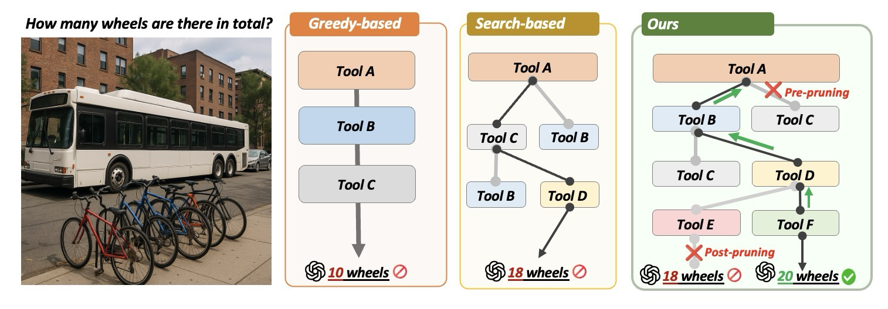
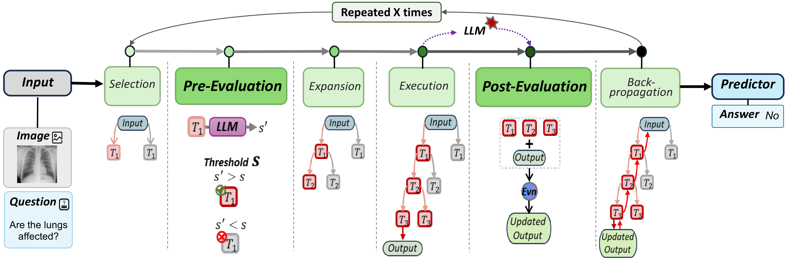
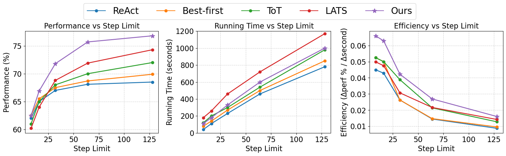

<h1 align="center">ToolTree: Efficient LLM Agent Tool Planning via<br>Dual-Feedback Monte Carlo Tree Search and Bidirectional Pruning</h1>

<h3 align="center">Accepted at ICLR 2026</h3>

<p align="center">
  Shuo Yang<sup>1</sup> &nbsp;&nbsp; Caren Han<sup>1</sup> &nbsp;&nbsp; Yihao Ding<sup>2</sup> &nbsp;&nbsp; Shuhe Wang<sup>1</sup> &nbsp;&nbsp; Eduard Hovy<sup>1</sup>
</p>
<p align="center">
  <sup>1</sup>The University of Melbourne &nbsp;&nbsp; <sup>2</sup>The University of Western Australia
</p>

<p align="center">
  <a href="https://openreview.net/forum?id=Ef5O9gNNLE"></a>
  <a href="https://openreview.net/pdf?id=Ef5O9gNNLE"></a>
</p>

<p align="center">
  <a href="https://syang2000.github.io/ICLR_2026_ToolTree/"></a>
</p>

<p align="center">
  <a href="https://syang2000.github.io/ICLR_2026_ToolTree/demo.html"></a>
  <a href="https://huggingface.co/spaces/Pleuron/ToolTree"></a>
</p>

<p align="center">
  <a href="LICENSE"></a>
</p>

---

## 💡 News

**[2026.07.05]** The [**project page**](https://syang2000.github.io/ICLR_2026_ToolTree/) and an [**🎮 interactive case walkthrough**](https://syang2000.github.io/ICLR_2026_ToolTree/demo.html) are now live!

**[2026.07.05]** The complete **official implementation** of ToolTree is released — MCTS main loop, dual (pre/post) evaluation, bidirectional pruning, real tool-execution mode, and the behavior test suite.

**[2026]** ToolTree is accepted at [**ICLR 2026**](https://openreview.net/forum?id=Ef5O9gNNLE)!

## 🌟 Overview

**ToolTree** is a novel Monte Carlo tree search-inspired planning paradigm for LLM agent tool planning. It explores possible tool usage trajectories using a **dual-stage LLM evaluation** and **bidirectional pruning** mechanism that enables the agent to make informed, adaptive decisions over extended tool-use sequences while pruning less promising branches before and after the tool execution.


<p align="center">
  
  <br>
  <em>Comparison of ToolTree with greedy search and search-based tool planning. ToolTree chooses the optimal tool trajectory and answers correctly with bidirectional pruning.</em>
</p>

## 🏗️ Architecture

<p align="center">
  
  <br>
  <em>Architecture overview of ToolTree. An input query is processed sequentially via iterative dual evaluation-guided Monte Carlo Tree Search, including selection, pre-evaluation, expansion, execution, post-evaluation and backward-propagation.</em>
</p>

### Key Components

- **Pre-Evaluation**: A fast predictive signal that estimates the utility of a tool *before* execution, filtering schema- or slot-incompatible calls before expansion.
- **Post-Evaluation**: Assesses the actual contribution of a tool *after* execution based on observed outcomes, pruning unproductive branches using real feedback.
- **Bidirectional Pruning**: Combines pre- and post-evaluation to eliminate unpromising branches, concentrating computational budget on promising tool chains.
- **Answer Predictor**: Incorporates the tool trajectories with the highest reward found by the MCTS to produce the final prediction.

## 📊 Results

ToolTree achieves state-of-the-art performance across 4 benchmarks spanning both closed-set and open-set tool planning scenarios, with an average gain of ~10% over existing methods.


### Efficiency Analysis

<p align="center">
  
  <br>
  <em>Figure 3: Progressive efficiency analysis across step limits. ToolTree achieves the highest efficiency (performance gain per second) compared with all baselines.</em>
</p>


### Case Study


<p align="center">
  
  <br>
</p>


## 🎮 Interactive Demo

Step through two real GTA cases rollout by rollout in the [**interactive case walkthrough**](https://syang2000.github.io/ICLR_2026_ToolTree/demo.html). Every step shows what the search actually did — candidate argument drafts with pre-evaluation scores (including pruned branches), real tool outputs from execution, post-evaluation, and Q/N backpropagation. All values on the page are taken verbatim from a logged run of this repository in real tool-execution mode.

## ⚙️ Installation

```bash
git clone https://github.com/SYang2000/ICLR_2026_ToolTree.git
cd ICLR_2026_ToolTree
pip install -r requirements.txt
```

## 📦 Benchmarks

ToolTree is evaluated on four public benchmarks. This repository ships no benchmark
data; download each from its official source and point the configs' `data_path` at it:

| Benchmark | Setting | Tasks / Tools | Official source |
|---|---|---|---|
| **GTA** | Closed-set | 229 real-world tasks, 14 executable tools | [open-compass/GTA](https://github.com/open-compass/GTA) · [HF dataset](https://huggingface.co/datasets/Jize1/GTA) |
| **m&m** | Closed-set | 882 human-verified multi-step multimodal tasks, 33 tools | [RAIVNLab/mnms](https://github.com/RAIVNLab/mnms) · [HF dataset](https://huggingface.co/datasets/zixianma/mnms) |
| **ToolBench** | Open-set | 16,464 real-world REST APIs (RapidAPI) | [OpenBMB/ToolBench](https://github.com/OpenBMB/ToolBench) |
| **RestBench** | Open-set | TMDB & Spotify REST scenarios | [Yifan-Song793/RestGPT](https://github.com/Yifan-Song793/RestGPT) |

For example, the two closed-set datasets can be fetched with:

```bash
# GTA (229 tasks, images included) -> data/gta/
python -c "from huggingface_hub import snapshot_download; \
           snapshot_download('Jize1/GTA', repo_type='dataset', local_dir='data/gta')"

# m&m (JSONL) -> data/mm/
python -c "from huggingface_hub import snapshot_download; \
           snapshot_download('zixianma/mnms', repo_type='dataset', local_dir='data/mm')"
```

The loaders accept items with `query` / `tools` / `gold_plan` / `context` /
`gold_answer` keys; see `src/evaluation/benchmarks.py::_normalize_item` for the full
list of accepted aliases when converting a downloaded dataset.

## 🚀 Quick Start

```bash
# Run on GTA benchmark
bash scripts/run_gta.sh

# Run on m&m benchmark
bash scripts/run_mm.sh
```

## 📋 Supported Features

✅ MCTS planning loop with dual (pre/post) evaluation and bidirectional pruning.

✅ Plan-level ("step-by-step") and real tool-execution modes.

✅ GTA & m&m closed-set pipelines with official data sources.

✅ Deterministic caching, content-keyed judge memoization, early stopping.

✅ Behavior test suite (32 tests).

🚧 Planned: open-set track (ToolBench, RestBench).

## 📋 Release Notes / Scope

This is the **official implementation of ToolTree** (the MCTS loop, dual evaluation,
bidirectional pruning, and answer prediction). Notes on this release:

- **Tool execution.** `tool_execution: mock` (the default) evaluates at the plan level
  ("step-by-step" mode) without invoking real tools; `tool_execution: real` executes
  tools through the backends in `src/tools/real_tools.py`, which can be extended per
  benchmark.
- **Benchmarks.** GTA and m&m run out of the box; the open-set loaders (ToolBench,
  RestBench) are not included in this release — see the table above for the official
  data sources.
- **Models.** Any OpenAI-compatible endpoint can be configured via `planner_llm` /
  `judge_llm` in the YAML configs; for endpoints that reject the optional `extra_body`,
  set `enable_thinking_toggle: false` (see `src/llm/client.py`).

## 🗂️ Project Structure

```
ICLR_2026_ToolTree/
├── run.py                       # Main entry point
├── configs/                     # YAML configuration files
│   ├── default.yaml             #   Default hyperparameters (Appendix B.4)
│   ├── gta.yaml                 #   GTA benchmark config
│   ├── mm.yaml                  #   m&m benchmark config
│   └── toolbench.yaml           #   ToolBench config (open-set; not in this release)
├── src/
│   ├── config.py                # Dataclass-based configuration
│   ├── llm/                     # LLM API wrapper
│   │   └── client.py            #   Unified client (OpenAI, local)
│   ├── mcts/                    # Monte Carlo Tree Search core
│   │   ├── node.py              #   MCTSNode with UCT selection (Eq. 1)
│   │   ├── tree_search.py       #   Main MCTS search loop (Section 3.1)
│   │   └── pruning.py           #   Bidirectional pruning (Section 3.2)
│   ├── agents/                  # Agent implementations
│   │   ├── base_agent.py        #   Abstract base agent
│   │   └── tooltree_agent.py    #   ToolTree orchestrator
│   ├── tools/                   # Tool management
│   │   ├── tool_registry.py     #   Tool card storage & retrieval
│   │   └── tool_manager.py      #   Execution with deterministic caching
│   ├── evaluation/              # Evaluation
│   │   ├── judge.py             #   LLM judge for pre/post scoring
│   │   ├── metrics.py           #   F1, pass rate, win rate
│   │   └── benchmarks.py        #   Data loaders (GTA, m&m; open-set loaders stubbed)
│   └── prompts/                 # Prompt templates
│       ├── pre_eval_prompt.py   #   Pre-evaluation judge (Appendix B.7)
│       ├── post_eval_prompt.py  #   Post-evaluation judge (Appendix B.8)
│       └── answer_prompt.py     #   Answer predictor
├── scripts/                     # Experiment launch scripts
├── data/                        # Datasets (download separately)
├── assets/                      # Figures and images
├── requirements.txt
├── LICENSE
└── README.md
```

## 📜 Citation

If you find this work useful, please cite our paper:

```bibtex
@inproceedings{yang2026tooltree,
title={ToolTree: Efficient {LLM} Tool Planning via Dual-Feedback Monte Carlo Tree Search and Bidirectional Pruning},
author={Shuo Yang and Caren Han and Yihao Ding and Shuhe Wang and Eduard Hovy},
booktitle={The Fourteenth International Conference on Learning Representations},
year={2026},
url={https://openreview.net/forum?id=Ef5O9gNNLE}
}
```


## License

This project is licensed under the MIT License - see the [LICENSE](LICENSE) file for details.

## Acknowledgements

We thank the reviewers for their valuable feedback. This work was supported in part by computational resources from Spartan at the University of Melbourne.
